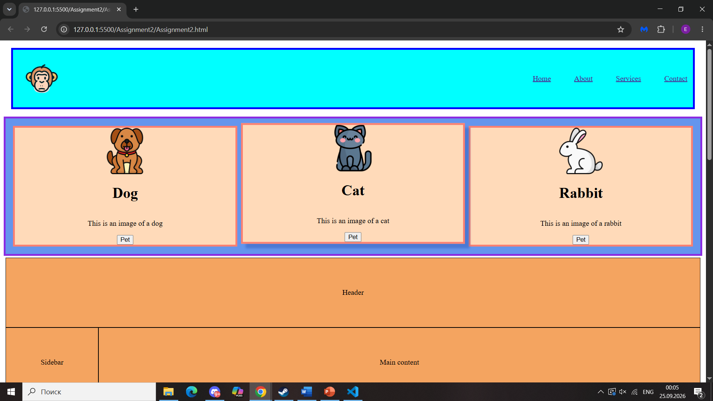
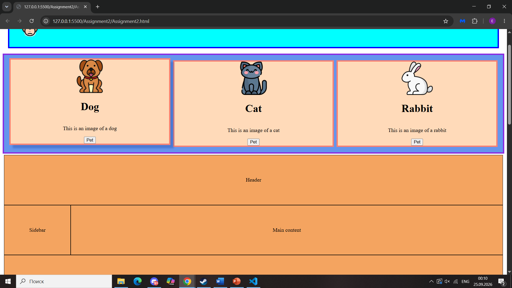
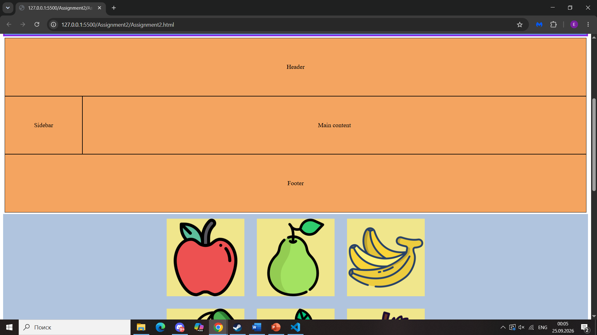
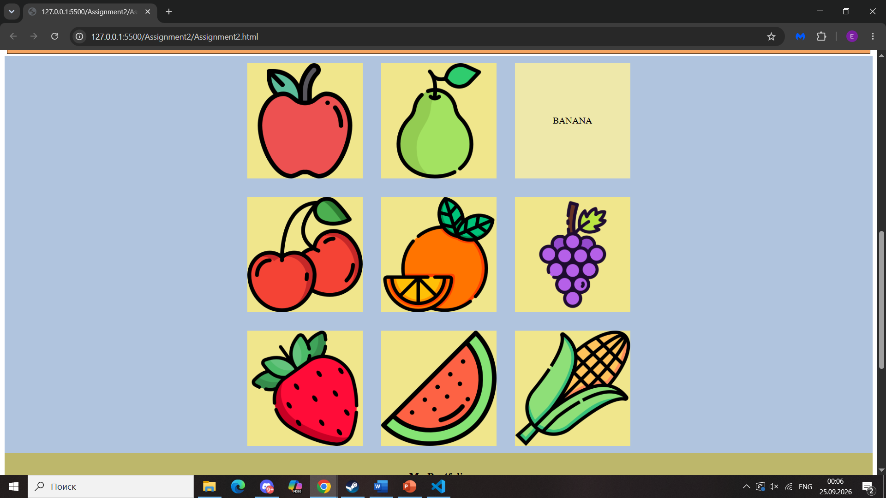
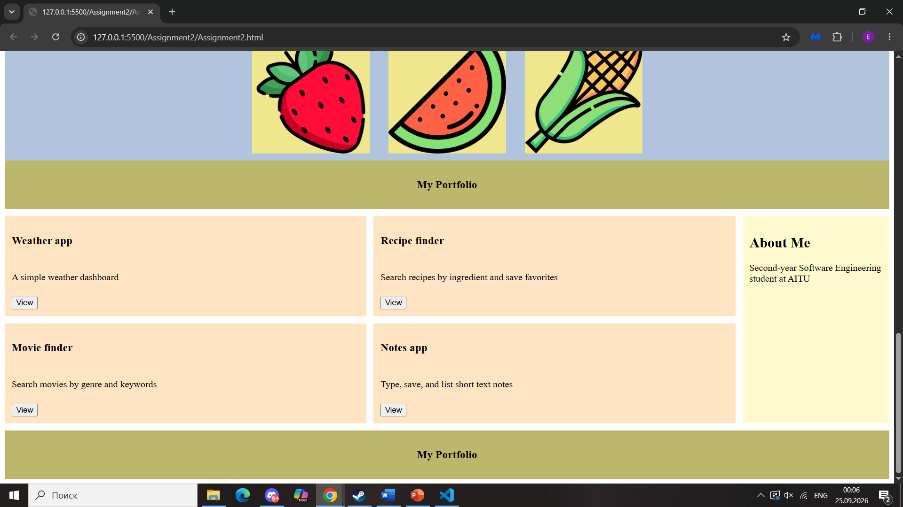

# WEB_Technologies1_Assignment2

- **Name:** Assanbayev Yelaman
- **Group:** SE-2538

## Part 1. Flexbox

### Task 0. Navigation Bar
I made a Flexbox header with the logo on the left and the links on the right.

### Task 1. Card Row
I made a flex container with three cards that contain images, titles, texts, and buttons. I also added a simple hover effect.

## Part 2. Grid System

### Task 2. Page Layout with Grid Areas
I made a grid container with a header across the top, the sidebar on the left, the main content on the right, the footer across the bottom.

### Task 3. Image Gallery
I made a 3x3 grid image gallery with consistent spacing. I also added a hover effect that displays a caption overlay when the user hovers over an image.

## Part 3. Combining Flexbox & Grid

### Task 4. Portfolio Page
I used Grid for the main section and used Flexbox for the header and project cards.

## Summary
I used Flexbox for one-dimensional layouts (header, card row, card contents) and Grid for two-dimensional layouts (gallery, page structure).
